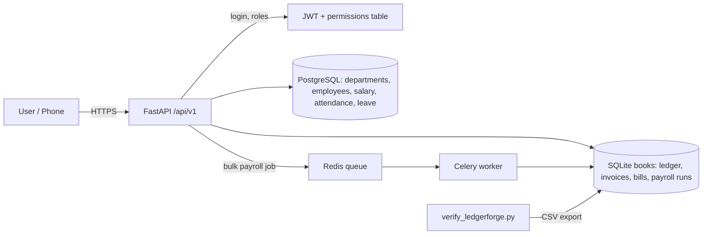

# LedgerForge architecture

```mermaid
flowchart LR
  U[User / Phone] -->|HTTPS| API[FastAPI /api/v1]
  API -->|login, roles| SEC[JWT + permissions table]
  API --> PG[(PostgreSQL: departments, employees, salary, attendance, leave)]
  API --> BOOKS[(SQLite books: ledger, invoices, bills, payroll runs)]
  API -->|bulk payroll job| Q[Redis queue]
  Q --> W[Celery worker]
  W --> BOOKS
  CHK[verify_ledgerforge.py] -->|CSV export| BOOKS
```

One payroll run: attendance + leave -> payroll engine -> payroll run (draft, processed, approved, paid) -> ledger entries -> trial balance -> P&L -> balance sheet.
